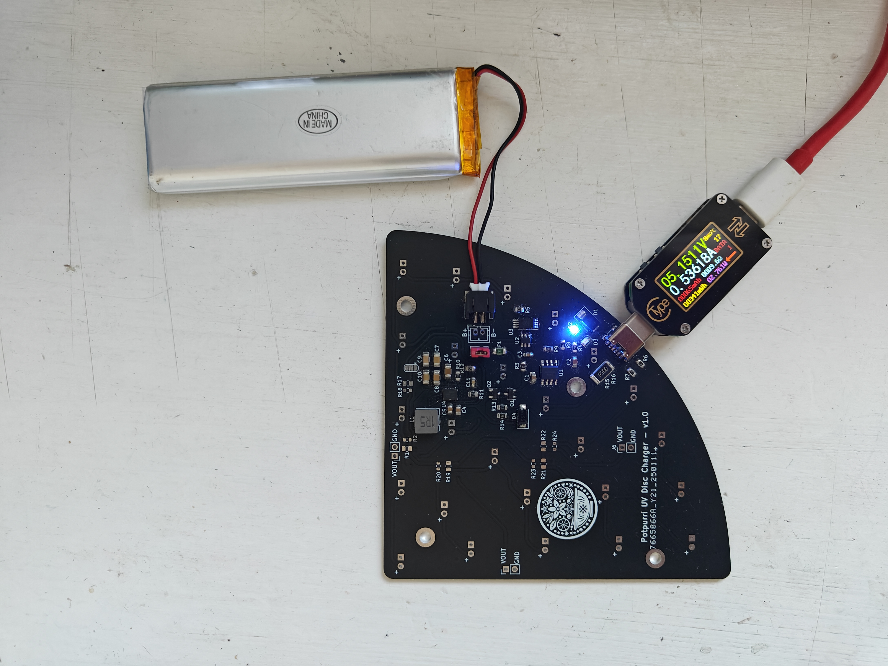
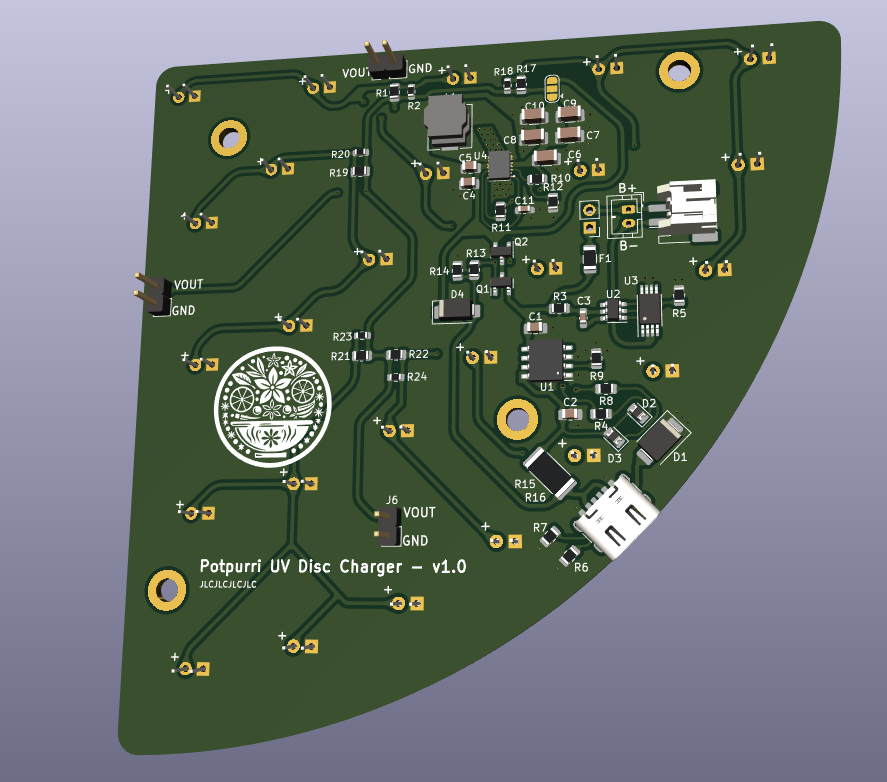
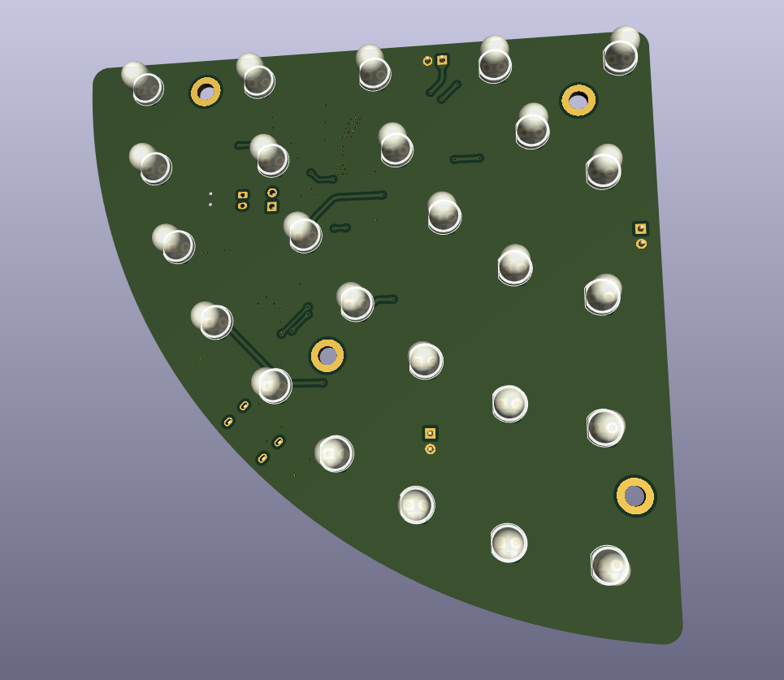
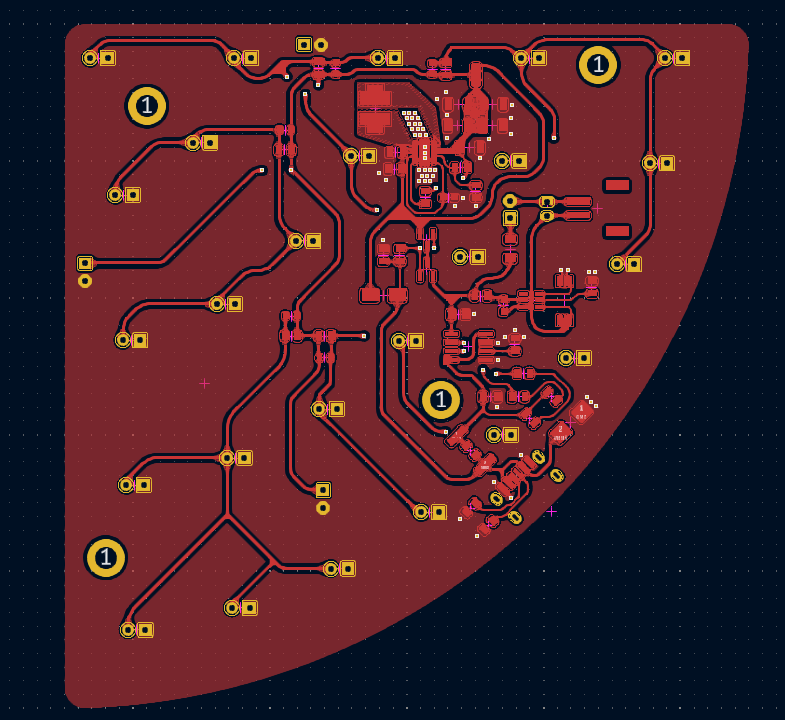
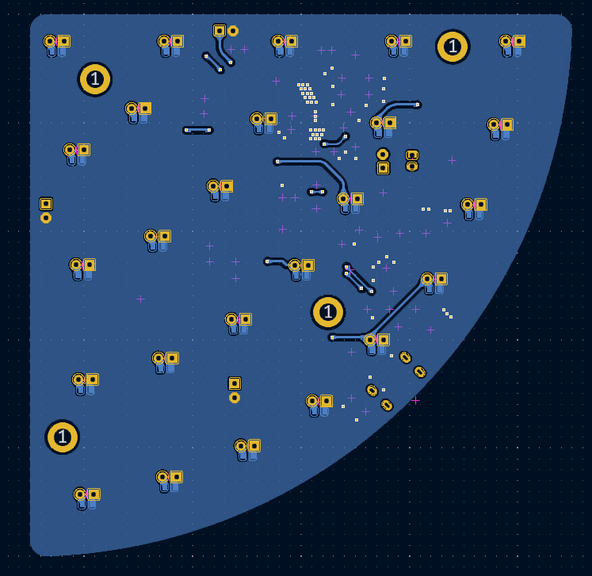
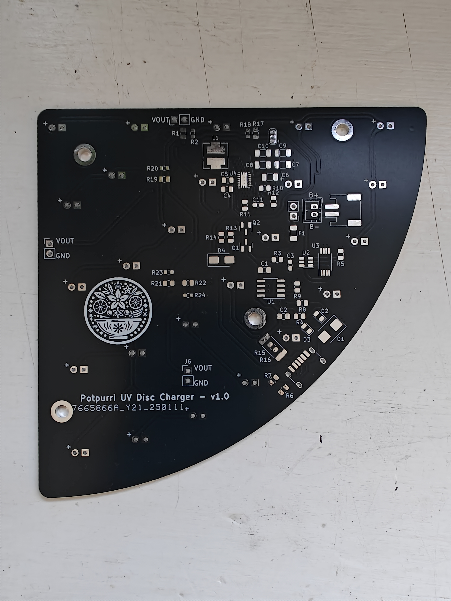
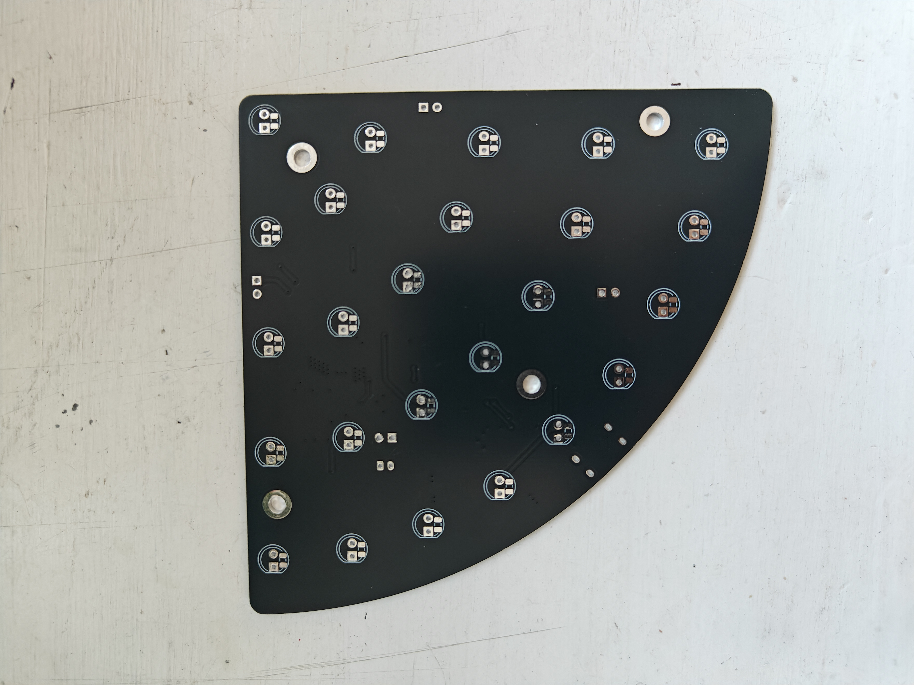
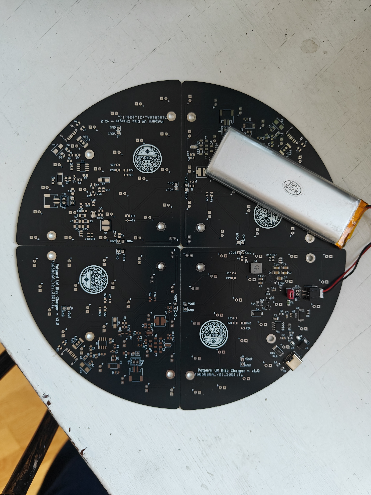

## UV Disc Charger

## Overview

This project presents a UV disc charger designed to illuminate glow-in-the-dark disc golf discs using 100 UV LEDs.

The circuit is powered by a LiPo battery, which is charged through a TP4056 with DW01A protection. The LEDs are driven by a TPS63020 buck/boost converter, and the battery is charged via a USB-C port.

**Note:** This project is a work in progress, aimed at exploring and learning more about these technologies.

## Features

The board includes the following components:

- **TP4056**: Monitors and manages the charging process.
- **DW01A Protection**: Ensures safe charging of the LiPo battery.
- **TPS63020 Buck/Boost Converter**: Efficiently drives 100 UV LEDs.
- **USB-C Port**: Enables battery charging.
- **Adjustable Charging Current**: The charging current is set using resistor R9, with the following settings:

| Resistor (Ω) | Charging Current (mA) |
|--------------|------------------------|
| 10k          | 130                    |
| 4k7          | 280                    |
| 3k           | 400                    |
| 2k           | 580                    |
| 1k5          | 780                    |
| 1k2          | 1000                   |

Below is an image showing the battery being charged at approximately 500mA:

## Images

Below are renderings of the PCB:

3D render of the front view of the PCB

3D render of the back view of the PCB

Front view of the actual PCB

Back view of the actual PCB

## Real PCB Images

Below are images of the actual PCB:

Front view of the real PCB

Back view of the real PCB

## Full Assembly

Below is an image showing the full assembly:

## Schematics

For detailed schematics, please refer to the [schematic PDF](imgs/schematic.pdf).

## License

This project is licensed under the MIT License. See the LICENSE file for more details.
 UV Disc Charger

## Overview

This project presents a UV disc charger designed to illuminate glow-in-the-dark disc golf discs using 100 UV LEDs.

The circuit is powered by a LiPo battery, which is charged through a TP4056 with DW01A protection. The LEDs are driven by a TPS63020 buck/boost converter, and the battery is charged via a USB-C port.

**Note:** This project is a work in progress, aimed at exploring and learning more about these technologies.

## Features

The board includes the following components:

- **TP4056**: Monitors and manages the charging process.
- **DW01A Protection**: Ensures safe charging of the LiPo battery.
- **TPS63020 Buck/Boost Converter**: Efficiently drives 100 UV LEDs.
- **USB-C Port**: Enables battery charging.
- **Adjustable Charging Current**: The charging current is set using resistor R9, with the following settings:

| Resistor (Ω) | Charging Current (mA) |
|--------------|------------------------|
| 10k          | 130                    |
| 4k7          | 280                    |
| 3k           | 400                    |
| 2k           | 580                    |
| 1k5          | 780                    |
| 1k2          | 1000                   |

Image showing the battery being charged at approximately 500mA:

## Images

Below are renderings of the PCB:

3D render of the front view of the PCB

3D render of the back view of the PCB

Front view of the actual PCB

Back view of the actual PCB

## Real PCB Images

Below are images of the actual PCB:

Front view of the real PCB

Back view of the real PCB

## Full Assembly

**WORK IN PROGRESS**

## Schematics

For detailed schematics, please refer to the [schematic PDF](imgs/schematic.pdf).
